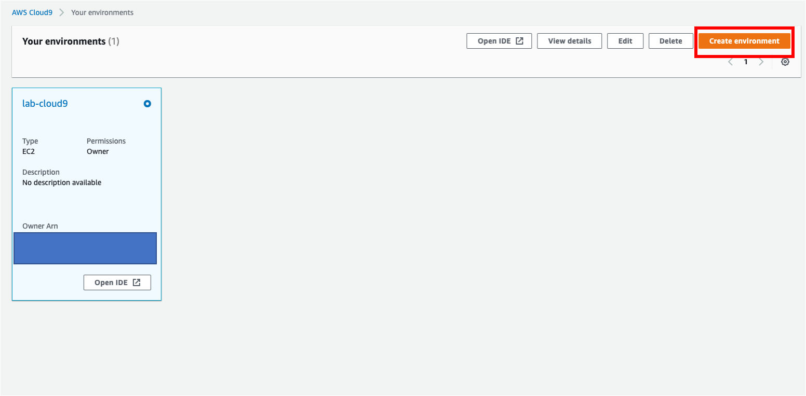
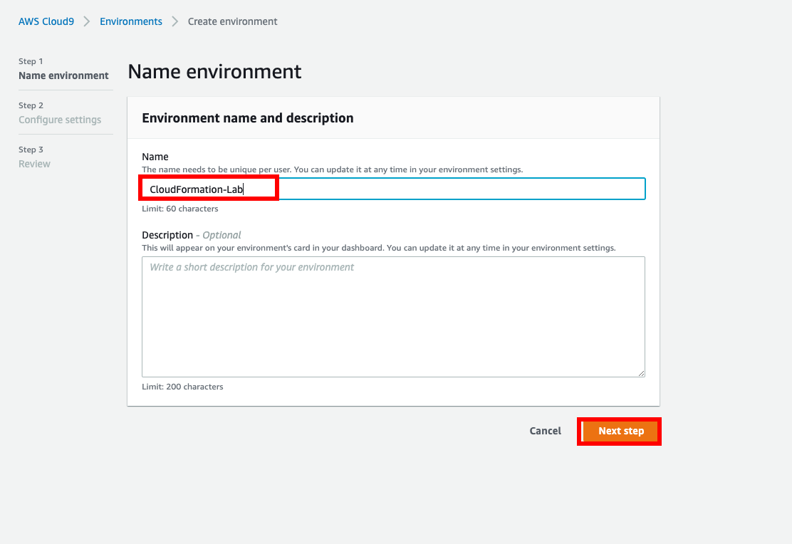
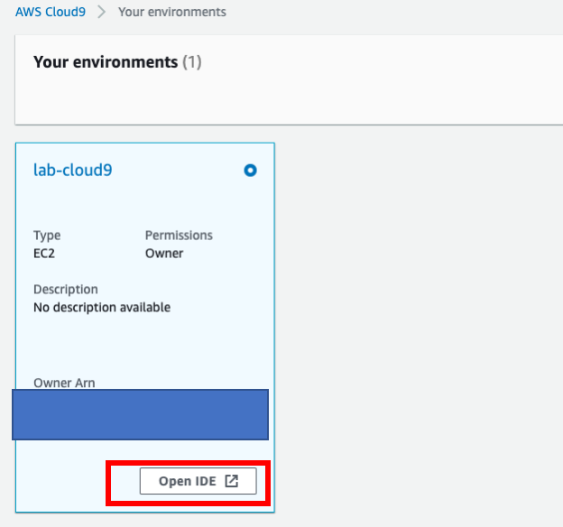
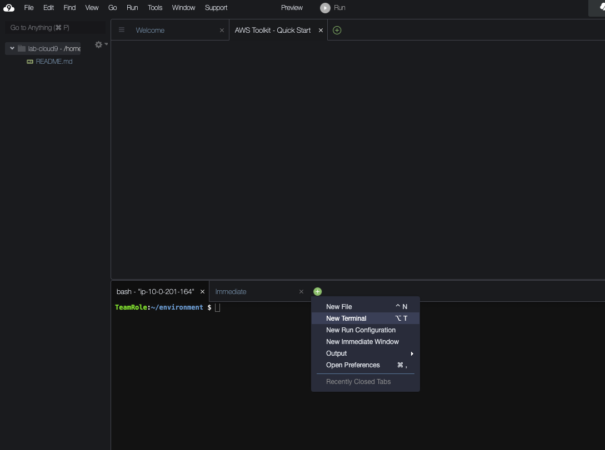
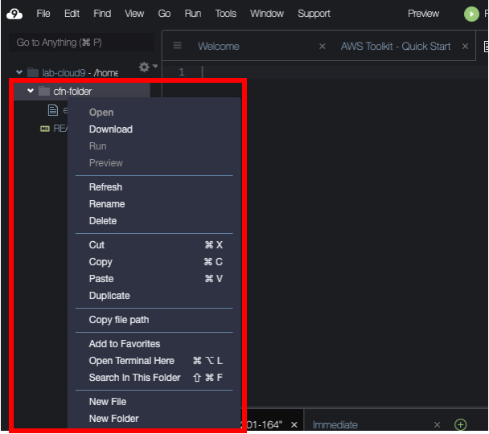
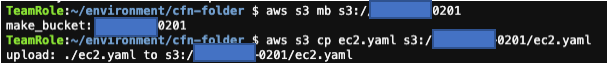
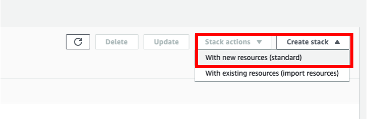
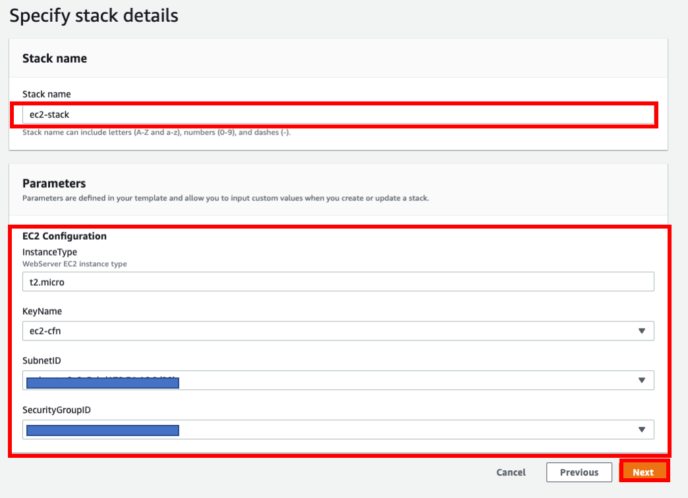
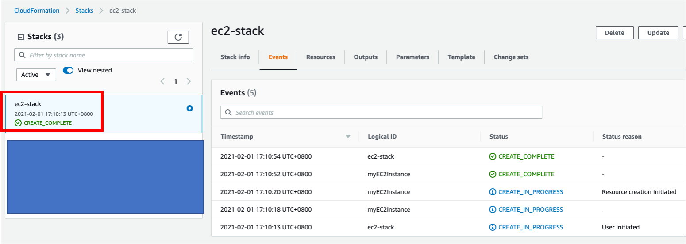

# CloudFormation Get Started
This Lab provides the step-by-step tutorial to create your first template. In this lab we will create a simple EC2 instance using cloudformation template and you will learn the basic concept about building, testing and debuging CloudFormation template.

[AWS Cloud9](https://aws.amazon.com/tw/cloud9/) (a cloud-based integrated development environment (IDE) that lets you write, run, and debug your code with just a browser) is used in this lab to develop your CloudFormation template and updload to [Amazon S3](https://aws.amazon.com/tw/s3/).


## 1. Create Cloud9 Enviorment

### 1.1
Visit [Cloud9 console](https://console.aws.amazon.com/cloud9/home?region=us-east-1#) and click **Create enviorment**



### 1.2
For Name, Enter `CloudFormation-Lab` and click **Ｎext step**



### 1.3
Remain default setting in following steps and click **Create enviornment**

## 2. Setup and build your first CloudFormation template on Amazon Cloud9 

### 2.1
In [Cloud9 console](https://console.aws.amazon.com/cloud9/home?region=us-east-1#), click **Open IDE**


### 2.2
After entering to Cloud9 enviroment, click **+** icon and add **New Terminal**



### 2.3
Run the following command to install cfn-lint tool which is used to check Syntax of your CloudFormation template

```
sudo pip install cfn-lint
```

### 2.4
Run the following command to create a work folder and cd into it.

```
mkdir cfn-folder
cd cfn-folder
```

### 2.5
Then, you can create a new yaml file by right clicking **cfn-folder** and name the new file as `ec2.yaml`


### 2.6
Paste the sample code of EC2 template including Parameters, Resouce, Output 


Note: the sample code is used in us-east-1, if you want to create stack in other regions, you should replace **ImageId** in ec2 properties, you can [use AWS CLI to search and print the ImageID](https://docs.aws.amazon.com/AWSEC2/latest/WindowsGuide/finding-an-ami.html)

```

Metadata:
  AWS::CloudFormation::Interface:
    ParameterGroups:
      -
        Label:
          default: "EC2 Configuration"
        Parameters:
          - InstanceType
          - KeyName
          - SubnetID
          - SecurityGroupID
Parameters:
  KeyName:
    Default: Name of an existing EC2 KeyPair to enable SSH access to the instance
    Type: 'AWS::EC2::KeyPair::KeyName'
    ConstraintDescription: must be the name of an existing EC2 KeyPair.
  InstanceType:
    Description: WebServer EC2 instance type
    Type: String
    Default: t2.micro
  SubnetID:
    Type: 'AWS::EC2::Subnet::Id'
  SecurityGroupID:
    Type: 'AWS::EC2::SecurityGroup::Id'
Resources:
  myEC2Instance:
    Type: AWS::EC2::Instance
    Properties:
      KeyName: !Ref KeyName
      ImageId: ami-0f5761c546ea1265a
      InstanceType: !Ref InstanceType
      SubnetId: !Ref SubnetID
      Monitoring: true
      SecurityGroupIds:
        - !Ref SecurityGroupID
 
      Tags:
        - Key: department
          Value: IT

Outputs:
  PublicIP: 
    Value: !GetAtt myEC2Instance.PublicIp
    Export: 
      Name: !Sub '${AWS::StackName}-Public-IP'!Sub ${AWS::StackName}-Public-IP
```


### 2.7
Create and download a new Keypair using AWS CLI by running following command in terminal

```
aws ec2 create-key-pair --key-name ec2-cfn --query "KeyMaterial" --output text > ec2-cfn.pem
```

### 2.8
Also, make sure your Keypair is created and downloaded in your enviornment successfully  

```
aws ec2 describe-key-pairs
```

### 2.9
Now, you can check if there is any syntax error in your yaml template by [cfn-lint](https://github.com/aws-cloudformation/cfn-python-lint)

```
cfn-lint ec2-yaml
```

### 2.10
If their is no error message, you can create an S3 bucket and upload your template to it.

Note: make sure your S3 bucket name is unique, so you'd better add some prefix or suffix

```
# create s3 bucket, replace the value in <your bucket name>
aws s3 mb s3://<your bucket name>

# copy ec2.yaml to your s3 bucket
aws s3 cp ec2.yaml s3://<your bucket name>/ec2.yaml
```


## 3. Create CloudFormation stack

### 3.1
Visit [CloudFormation console](https://console.aws.amazon.com/cloudformation/home?region=us-east-1#/stacks?filteringText=&filteringStatus=active&viewNested=true&hideStacks=false), click **Create stack -> With new resources(standard)** 


### 3.2
For **Amazon S3 URL** enter your S3 URL `https://<your bucket name>.s3.amazonaws.com/ec2.yaml` and click **Next**


### 3.3

For **Stack name**, enter `ec2-stack`, select parameters and click **Next**


### 3.4
Remain all default setting in following steps and click **Create Stacks**

### 3.5
After few minutes, visit [CloudFormation/Stacks](https://console.aws.amazon.com/cloudformation/home?region=us-east-1#/stacks). 

If the status shows **CREATE_COMPLETE**, your EC2 instance is successfully created!
Now, you can check Outputs and Resources tab to ensure the stack is created correctly.


If not, you can check the error message in events tab
